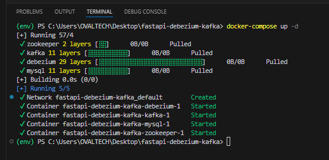
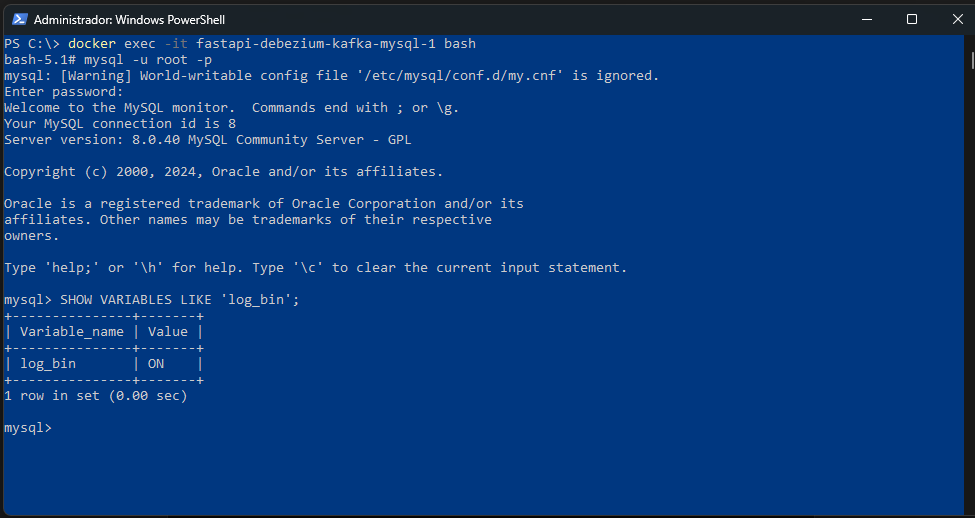
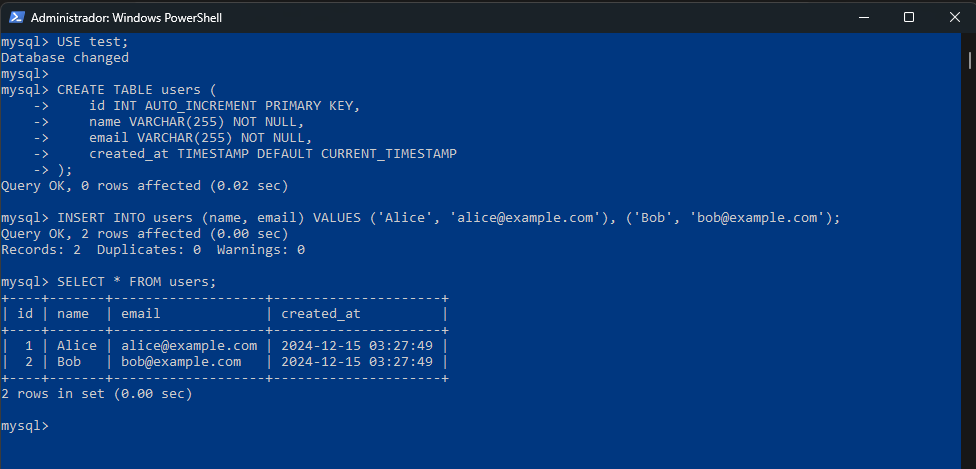
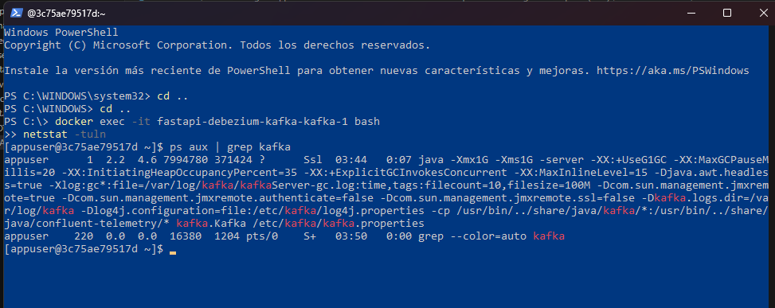

# Building an App with Debezium and Kafka: Real-Time Data Capture with Change Data Capture (CDC)

## Introduction

In today's fast-paced data-driven world, Change Data Capture (CDC) plays a pivotal role in enabling real-time data processing. Debezium is one of the most popular tools for capturing database changes and streaming them into systems like Apache Kafka. In this article, we will explore how to build a real-time data capture application using Debezium and Kafka to capture data modifications (inserts, updates, deletes) from a database and stream them for further processing.

## Installing Dependencies

To get started with Debezium and Kafka, you will need to install Kafka and Debezium connectors. Additionally, we'll need Docker to run Kafka and Zookeeper (which Kafka depends on).

Run the following commands to install the necessary dependencies and Docker images:

```bash

# Install Kafka and Zookeeper using Docker
docker-compose up -d

# You may need to install other dependencies to interact with Kafka from your application
pip install kafka-python

```

You'll also need Docker Compose to start the Kafka and Zookeeper services for local development.

## Setting Up Kafka and Debezium

To simplify the setup, we'll use Docker Compose to run Kafka, Zookeeper, and the Debezium connectors.

Here’s a simple docker-compose.yml that sets up Zookeeper, Kafka, and Debezium:

```yaml
version: '3' services: zookeeper: image: wurstmeister/zookeeper:3.4.6 ports: - "2181:2181" environment: ZOOKEEPER_CLIENT_PORT: 2181 ZOOKEEPER_TICK_TIME: 2000

kafka: image: wurstmeister/kafka:latest ports: - "9093:9093" expose: - "9093" environment: KAFKA_LISTENER_SECURITY_PROTOCOL: PLAINTEXT KAFKA_LISTENER_NAME_INTERNAL: INSIDE KAFKA_ADVERTISED_LISTENERS: INSIDE://kafka:9093 KAFKA_LISTENER_PORT: 9093 KAFKA_ZOOKEEPER_CONNECT: zookeeper:2181

debezium: image: debezium/connect:latest ports: - "8083:8083" environment: - BOOTSTRAP_SERVERS=kafka:9093 - GROUP_ID=1 - CONFIG_STORAGE_TOPIC=dbz_configs - OFFSET_STORAGE_TOPIC=dbz_offsets - INTERNAL_KEY_CONVERTER=org.apache.kafka.connect.storage.StringConverter - INTERNAL_VALUE_CONVERTER=org.apache.kafka.connect.json.JsonConverter
```

Kafka runs on localhost:9093.
Debezium runs on localhost:8083.

## Setting Up the Database for CDC

In this example, we’ll use MySQL to simulate a real-world scenario. You’ll need to set up a MySQL database and enable binlog to capture changes:

`sql -- In MySQL, enable binlog for CDC -- Add the following lines to your MySQL config file (my.cnf): log-bin=mysql-bin binlog-format=row server-id=223344 `

Once you’ve done this, Debezium will be able to connect to MySQL and capture data changes.

## Creating the Change Data Capture (CDC) Connector

Now, let’s create a Debezium connector to start capturing changes from the MySQL database. Use the Debezium REST API to configure the connector:

```bash
curl -X POST -H "Content-Type: application/json"
--data '{ "name": "mysql-connector", "config": { "connector.class": "io.debezium.connector.mysql.MySqlConnector", "tasks.max": "1", "database.hostname": "mysql", "database.port": "3306", "database.user": "debezium", "database.password": "dbz", "database.server.id": "184054", "database.server.name": "dbserver1", "database.whitelist": "test", "database.history.kafka.bootstrap.servers": "kafka:9093", "database.history.kafka.topic": "dbhistory.fullfillment" } }'
http://localhost:8083/connectors
```

This will configure Debezium to listen to the MySQL database and stream changes to Kafka.

## Building the Consumer Application

Next, let's build a simple consumer application that reads messages from Kafka using Python. This application will print the changes captured by Debezium in real-time.

```python
from kafka import KafkaConsumer import json

# Kafka consumer to read messages from the topic
consumer = KafkaConsumer( 'dbserver1.test.users', # The topic name (change it based on your MySQL table) bootstrap_servers=['localhost:9093'], group_id='debezium-group', value_deserializer=lambda x: json.loads(x.decode('utf-8')) )

# Consume messages from the Kafka topic
for message in consumer: print(f"Captured change: {message.value}")
```

This script connects to the Kafka server, subscribes to the topic where Debezium is sending the data, and prints out the changes.

## Running the Application

Once everything is set up, you can start the Kafka, Zookeeper, and Debezium containers using Docker Compose:

```bash
docker-compose up -d
```

After the services are running, you can use the Python consumer to start capturing changes and print them in real-time.

## Example Request and Response

Once the CDC connector is running and changes are being captured by Kafka, here's an example of a change captured when a record is inserted into the users table in MySQL.

### Request (Insert record into MySQL):

```sql
INSERT INTO users (id, name) VALUES (1, 'John Doe');
```

### Response (Captured by Kafka/Consumed by Python):

```json
{
  "before": null,
  "after": { "id": 1, "name": "John Doe" },
  "source": {
    "version": "1.4.0.Final",
    "connector": "mysql",
    "name": "dbserver1",
    "server_id": 184054,
    "ts_sec": 1604233475
  }
}
```

## Conclusion

Building a real-time data capture application with Debezium and Kafka enables powerful streaming and event-driven architectures. In this tutorial, we’ve demonstrated how to capture database changes in real-time and stream them for further processing. Using Debezium with Kafka provides a reliable and scalable solution for Change Data Capture (CDC) in modern applications.

You can find the complete code for this project on GitHub: GitHub Link.

### Pictures



```powershell
docker exec -it fastapi-debezium-kafka-mysql-1 bash

mysql -u root -p
# Introduce la contraseña: root

SHOW VARIABLES LIKE 'log_bin';
SHOW VARIABLES LIKE 'binlog_format';
SHOW VARIABLES LIKE 'server_id';

```



```sql
-- 1 yml
-- CREATE DATABASE test;

--2
USE test;

-- 3
CREATE TABLE users (
    id INT AUTO_INCREMENT PRIMARY KEY,
    name VARCHAR(255) NOT NULL,
    email VARCHAR(255) NOT NULL,
    created_at TIMESTAMP DEFAULT CURRENT_TIMESTAMP
);

-- 4 Insert
INSERT INTO users (name, email) VALUES
('Alice', 'alice@example.com'),
('Bob', 'bob@example.com');


-- 5
SELECT * FROM users;


-- 6 mysql>
exit

-- 7 bash-5.1#
exit
```



```bash
docker network create kafka-net
docker network connect kafka-net fastapi-debezium-kafka-kafka-1
docker network connect kafka-net fastapi-debezium-kafka-debezium-1
docker network connect kafka-net fastapi-debezium-kafka-zookeeper-1

docker network ls

```

PS C:\> docker network ls
NETWORK ID NAME DRIVER SCOPE
aaa883c81bc8 booksapi_default bridge local
3b9d5bc47b93 bridge bridge local
228e4fd91426 fastapi-debezium-kafka_default bridge local
98fae80f999a host host local
bd32b24b1610 kafka-net bridge local
b36168727eca none null local
PS C:\>

```bash

docker exec -it fastapi-debezium-kafka-kafka-1 bash
netstat -tuln
```

```bash

# [appuser@3c75ae79517d ~]$
ps aux | grep kafka
```




```
docker exec -it fastapi-debezium-kafka-kafka-1 bash

cd /usr/bin

kafka-console-consumer --bootstrap-server localhost:9092 --topic dbserver1.public.users --from-beginning

```

## LOGS DE TODO
```BASH
docker logs fastapi-debezium-kafka-kafka-1
```
```
kafka-broker-api-versions --bootstrap-server kafka:9092

kafka-topics --bootstrap-server kafka:9092 --list

```